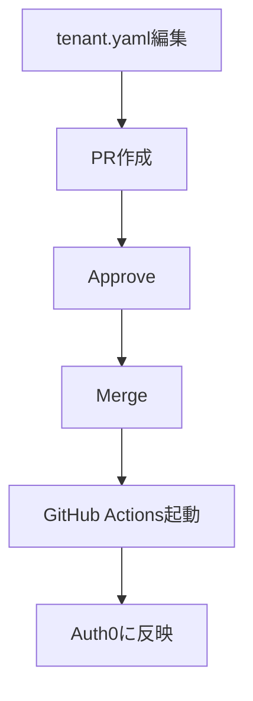

認証にAuth0を導入した際に、Web UIで手動設定していると以下のような課題があります。

- **変更履歴が追えない**
- **環境間の差異管理が困難**
- **レビューができない**
- **ロールバックが困難**

Auth0もAWSやGCPのようにIaC（Infrastructure as Code）で管理できないのかと考えていたところ、Auth0 Deploy CLI が提供されていたので、Auth0設定のIaC化と GitHub Actions での自動反映を実装しました。

## Auth0 Deploy CLI

[Auth0 Deploy CLI](https://github.com/auth0/auth0-deploy-cli) は、Auth0が公式に提供しているCLIツールで、Auth0の設定をYAMLやJSON形式でエクスポート/インポートできます。

:::message
**Machine to Machine Applicationの作成が必要**

Auth0 Deploy CLIを使用するには、Auth0側でMachine to Machine Applicationの作成と、Auth0 Management APIへの適切な権限付与が必要です。
:::

## ファイル構成


```
.
│── config.json
│── tenant.yaml
└── databases/
```

### config.jsonの設定

```json
{
  "AUTH0_DOMAIN": "Auth0 tenant domain",
  "AUTH0_ALLOW_DELETE": false,
  "AUTH0_EXCLUDED": []
}
```

- **AUTH0_DOMAIN**: Auth0のテナントドメイン
- **AUTH0_ALLOW_DELETE**: `false`に設定することで、削除操作を防ぐ
- **AUTH0_EXCLUDED**: 管理対象外のリソースを指定

## GitHub Actionsによる自動反映

### ディレクトリ構成

```
.
├── .github/
│   └── workflows/
│       └── auth0-import.yml
│── config.json
│── tenant.yaml
└── databases/
```

### フロー



### Auth0 Importワークフロー


```yaml:.github/workflows/auth0-import.yml
name: Import to Auth0

on:
  push:
    branches:
      - main

jobs:
  import-to-auth0:
    runs-on: ubuntu-latest
    if: github.ref == 'refs/heads/main'
    steps:
      - name: Checkout
        uses: actions/checkout@v3

      - name: Setup Node
        uses: actions/setup-node@v3
        with:
          node-version: 'lts/*'

      - name: Install Auth0 Deploy CLI
        run: npm install -g auth0-deploy-cli

      - name: Import to Auth0
        env:
          AUTH0_CLIENT_ID: ${{ secrets.AUTH0_CLIENT_ID }}
          AUTH0_CLIENT_SECRET: ${{ secrets.AUTH0_CLIENT_SECRET }}
        run: a0deploy import -c ./config.json -i ./tenant.yaml
```

https://auth0.com/docs/ja-jp/deploy-monitor/deploy-cli-tool/use-as-a-cli

## GitHub Secretsの設定

Client IDとClient Secretを設定します。

1. GitHubリポジトリ → Settings → Secrets and variables → Actions
2. 以下のSecretを追加:
   - `AUTH0_CLIENT_ID` : Auth0のMachine to Machine ApplicationのClient ID
   - `AUTH0_CLIENT_SECRET`: Auth0のMachine to Machine ApplicationのClient Secret
